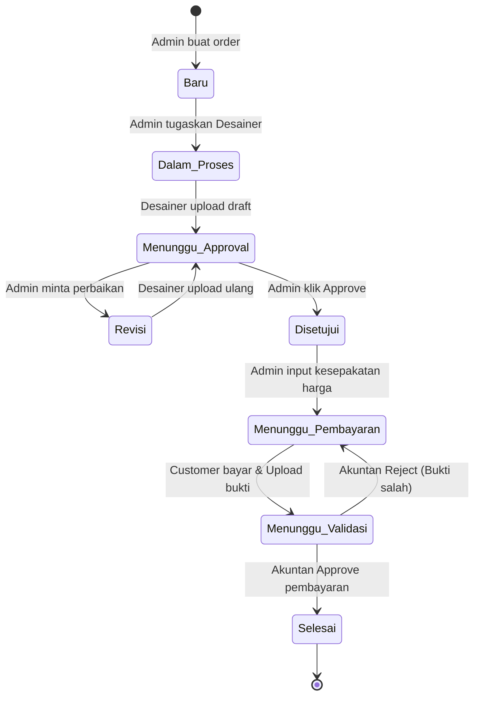
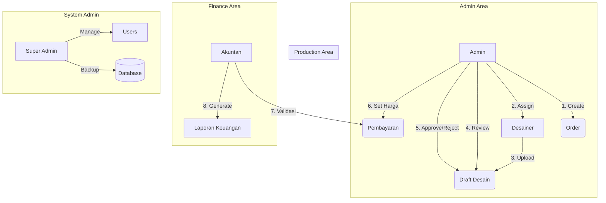

# Alur Kerja Sistem (Workflow)

Dokumen ini menjelaskan alur teknis dan logika bisnis yang diterapkan dalam sistem RBPL menggunakan diagram visual.

---

## 1. Diagram Status Pesanan (Order Lifecycle)

Setiap pesanan (`Order`) memiliki siklus hidup yang ditentukan oleh statusnya. Berikut adalah transisi status yang terjadi:

---

## 2. Interaksi Antar Peran (Role Interaction)

Diagram ini menunjukkan bagaimana setiap aktor berinteraksi dengan sistem dan satu sama lain:

---

## 3. Penjelasan Teknis Singkat

- **Autentikasi**: Menggunakan sistem auth bawaan Laravel dengan middleware `role`.
- **Penyimpanan File**: Draft desain dan bukti pembayaran disimpan di folder `storage/app/public` dan diakses melalui symbolic link.
- **Relasi Database**:
    - `User` has many `Order` (sebagai pembuat atau desainer).
    - `Order` has many `Desain` (untuk riwayat iterasi).
    - `Order` has one `Pembayaran`.
    - `Customer` has many `Order`.
